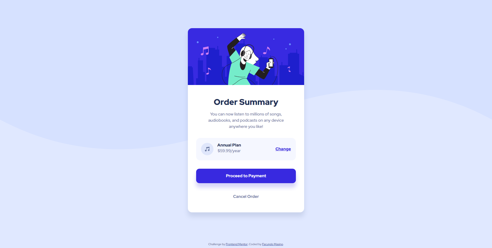

# Frontend Mentor - Order summary card solution

This is a solution to the [Order summary card challenge on Frontend Mentor](https://www.frontendmentor.io/challenges/order-summary-component-QlPmajDUj). Frontend Mentor challenges help you improve your coding skills by building realistic projects. 

## Table of contents

- [Frontend Mentor - Order summary card solution](#frontend-mentor---order-summary-card-solution)
  - [Table of contents](#table-of-contents)
  - [Overview](#overview)
    - [The challenge](#the-challenge)
    - [Screenshot](#screenshot)
    - [Links](#links)
  - [My process](#my-process)
    - [Built with](#built-with)
    - [Useful resources](#useful-resources)
  - [Author](#author)

**Note: Delete this note and update the table of contents based on what sections you keep.**

## Overview

### The challenge

Users should be able to:

- See hover states for interactive elements

### Screenshot

### Links

- Solution URL: [GitHub](https://github.com/FacuMasino/order-summary-component)
- Live Site URL: [GitHub Pages](https://facumasino.github.io/order-summary-component/)

## My process

As mentioned in the style-guide I first started with the HTML structure of the solution, then the CSS/SASS coding. For the SASS code I used a very simple structure which consists in 4 files: base, components, layouts and main.

- base: contains resets, variables, mixins and utility classes.
- components: resuable classes.
- layout: the CSS that handles the layout, the main structure.
- main: contain the imports for all the files.

Also I used normalize.css for handling all the resets and avoid typical problems with browsers compatibility.

### Built with

- Semantic HTML5 markup
- SASS
- Flexbox
- Normalize.css

### Useful resources

- [Structuring your sass projects](https://itnext.io/structuring-your-sass-projects-c8d41fa55ed4) - This helped me choosing the right file structure project for SASS.
- [MDN Mozilla](https://developer.mozilla.org/) - Always helpful when needing to understand how something works.
- [Coolors](https://coolors.co/e0e8ff-3829e0-f5f7ff-7280a7-1f2f56) - Great to see the entire pallet of colors and save it for later.
## Author

- Frontend Mentor - [@FacuMasino](https://www.frontendmentor.io/profile/FacuMasino)
- LinkedIn - [@facundomasino](https://www.linkedin.com/in/facundomasino/)